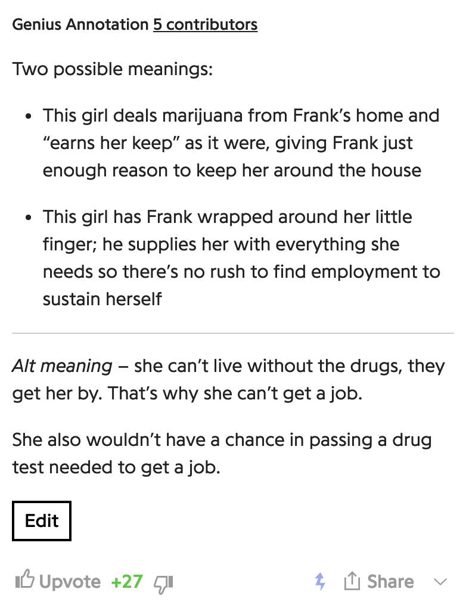
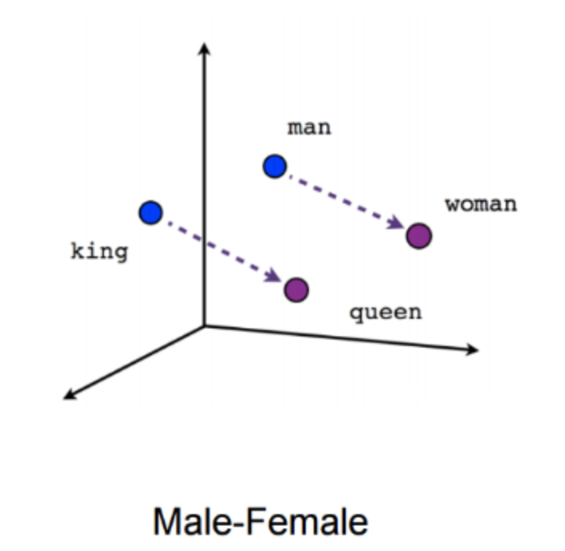
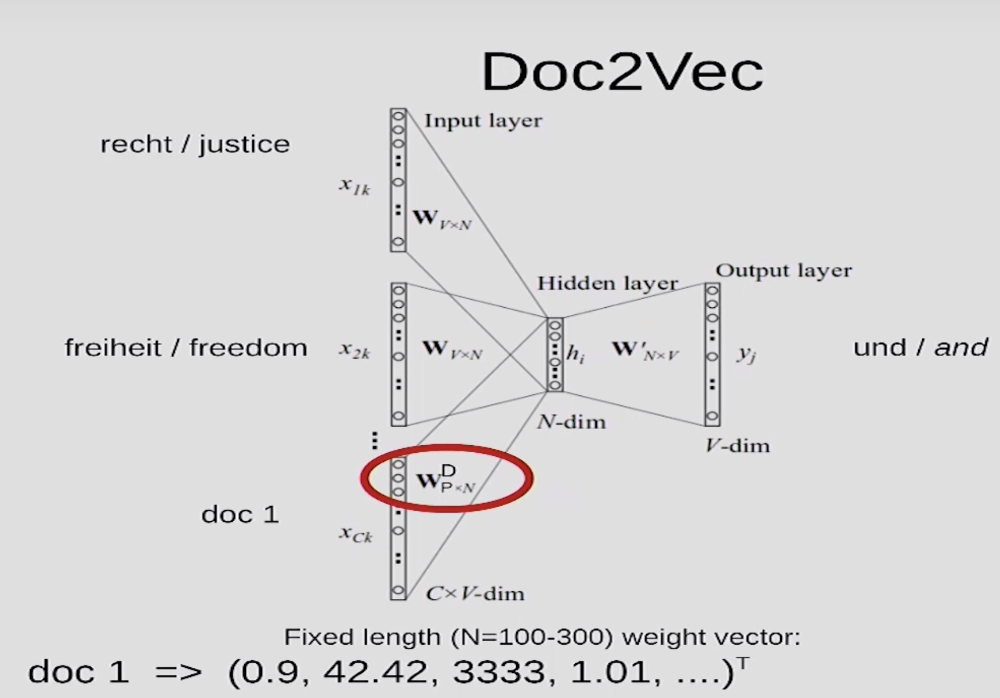
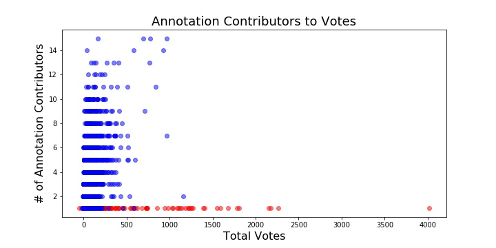
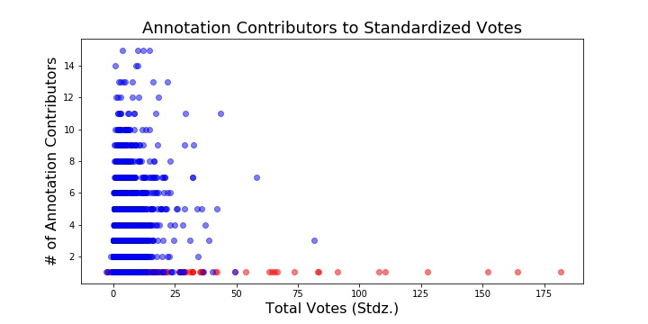
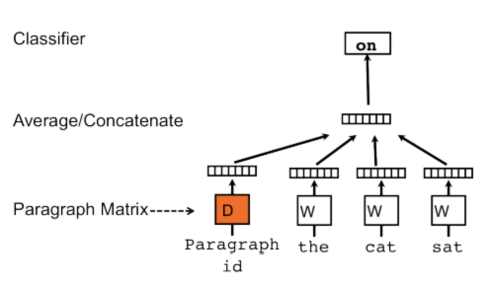
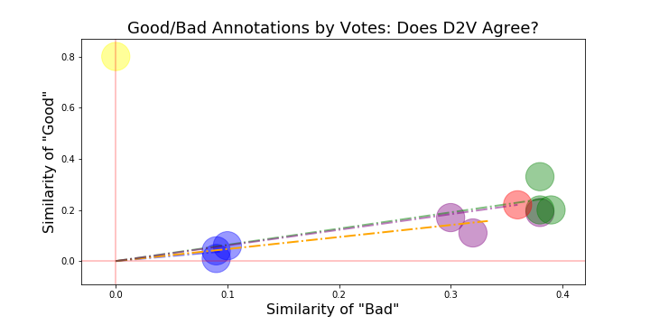
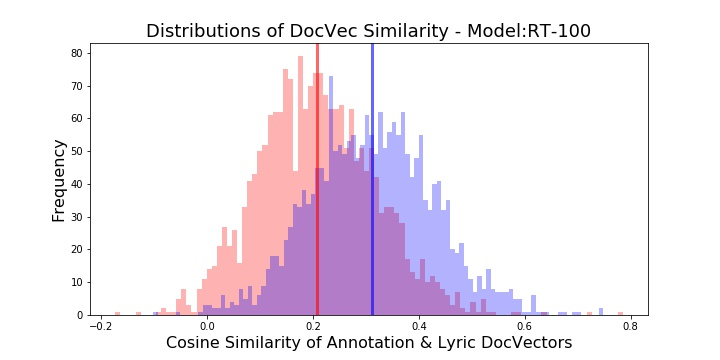

# Annotated Lyrics: Are they *"Genius?"*

### Using Doc2Vec to Evaluate Crowdsourced Lyric Annotations on Genius.com

Capstone II Project for Galvanize Data Science Immersive

by Taite Sandefer

## Table of Contents
- [Introduction](#introduction)
- [Strategy and Process](#strategy-and-process)
- [Overview of the Data](#overview-of-the-data)
- [Model Selection](#model-selection)
- [Results](#results)


# Introduction
## What is Genius?
[Genius](https://genius.com/), formerly "Rap Genius," is a website where users can view and add annotations to lyrics that help explain their meaning and context.


## Problem
Today, the Genius system still relies heavily on crowdsourced human work. When an annotation gets posted, it must be read and "accepted" by a higher-ranking user in the community for it to stick on the public lyrics page.

* Human error
    * Accepting "bad" annotations (FP)
    * Rejecting "good" annotations (FN)
* Time

If the moderators are busy, or uninterested, good annotations can go unreviewed and unposted. Additionally, a grumpy moderator might let poor annotations slip through, or choose to trash good annotations. If moderators do take the time to read through annotations, it's likely to take up a lot of their time. If it were possible to reliably automate this process, it would likely save time and increase the accuracy of evaluation.


## A Potential Solution
Thanks to some exciting innovations in NLP over the past few years, it might be possible to create an evaluation system that is able to automatically accept/reject user-submitted annotations.

In order to create a system like this, we must consider: **What makes a "good" Genius annotation?**


The main goal of Genius is to explain lyrics and help make them more accessible to listeners. Generally, these are explanations regarding the semantic and/or cultural meanings behind lyrics, which can often cryptic and filled with linguistic subtleties that we wouldn't normally expect a computer to pick up on, like the double meaning in this line of Frank Ocean's *Pilot Jones*:




However, annotations can be anything that helps add to the experience of the music, which isn't limited to this sort of explanation. For example, verified artists can annotate their own lyrics, and often discuss how they were feeling the day they wrote the lines, rather than explaining the meaning behind them.

Eminem does this a lot, actually. For example...


# Strategy and Process
## Why not BoW?
The Tf-idf and BoW approach to text encoding might not be best at capturing what we're looking for, since they represent language based on a more simplified perspective of frequency and co-occurrence of words. When we're looking at *meaning,* it's easy to see how these methods could fall short.

For example, the words "like" and "love" are almost identical in semantic meaning and linguistic function. However, they might not occur near each other, since they're almost too similar for someone to consistently use them alongside each other.

## Doc2Vec to the Rescue!
But, the words that occur around "like" and "love" are likely similar and could tell us more about their actual usage patterns. That's what Doc2Vec uses to help pick up on more subtle linguistic patterns, which is why Doc2Vec is likely better suited to this lyric-annotation problem than other text-encoding methods.


## Learning a Word from its Context
```"Tell me who your friends are, and I'll tell you who you are"```

Doc2Vec is a neural network model that strives to learn how to best encode words, and documents, into vectors that represent their contextual orientation, based on what it learned in training.

```“The meaning of a word can be inferred by the company it keeps"```


The idea is that as you read lines of text, a latent "context window" traverses through the text and captures the aggregate meaning of the words within, but continues to shift and evolve as it moves along the text.

### Interesting Properties of Word/Doc2Vec





As an extension of Word2Vec, which was originally published in 2013, Doc2Vec has two architectural flavors.

* Distributed Bag of Words
    * Pr(word | surrounding words)
* Distributed Memory
    * Pr(surrounding words | word)
    * Generally has been found to perform better, particularly with semantic tasks




## Necessary Assumptions
* Distributional Hypothesis: words that frequently occur near each other will have similar semantic meanings

* "Good" annotations are contextually similar to the lyric they describe. Compared to the lyrics they describe, annotations are more verbose and use plain language (as opposed to prose) and are more explicitly clear.

* The vocabulary used by annotations will generally not be the same as the vocabulary used in the annotation itself, except with specific rare/slang words that are the object of discussion. When they are similar, this isn't as much about the quality of the annotation -- most annotations can, and do, repeat some of the exact verbage of the lyrics. What matters is that the words utilized that aren't identical in literal vocabulary ARE similar in their semantic/contextual meaning. AKA, they tend to have "similar neighbors" as each other.


[Back to Top](#Table-of-Contents)


# Overview of the Data
This data came from the Genius API and has been stored in both MongoDB and .csv files using BeautifulSoup, requests, and johnwmillr's [LyricsGenius](https://github.com/johnwmillr/LyricsGenius). This information came from scraping all annotations from the top 50 songs from the 20 most active artists on Genius.

I pulled the text and other characteristic features for annotations and their corresponding lyric segments. Although I had planned to get about 17,000 observations, I ended up with 3,573 lyric-annotation pairs.

Unfortunately, the Genius API does not provide access to data on "rejected" annotations. Thus, we need to use other features to help us distinguish between "good" and "bad" annotations.

### Engineered Features
- Votes per 100k viewers
- Character count for text
- Word count for text
- Cosine Similarity of annotation-lyric pair


[Back to Top](#Table-of-Contents)

## Distribution of Groups

### Top 12 Artists on Genius

| | Artist | Songs in Corpus | Total Annotations |
|--- | --- | --- | --- |
|1| Drake | 33 | 314 |
|2| Eminem | 43 | 426 |
|3|Kendrick Lamar | 35 | 350 |
|4| Kanye West | 35 | 341 |
|5| The Weeknd | 34 | 286 |
|6| J. Cole | 46 | 438 |
|7| XXXTENTACION | 38 | 254 |
|8| Lil Wayne | 14 | 139 |
|9| Original Broadway Cast of Hamilton | 46 | 457 |
|10| JAY-Z | 18 | 180 |
|11| Ariana Grande | 41 | 273 |
|12| Beyoncé | 12 | 115 |






## Engineering Data for Testing

It looks like "Votes" might not be a great metric for determinng whether an annotation is good or not!

However, there are many studies in the past that have had promising experiences using Doc2Vec to predict whether a piece of text is similar to another piece of text.

Researchers have often created datasets to do this by mixing up pairings between sentences and paragraphs, which they do or don't belong to, and compared the similarity of vectors from true matches and false matches.

For testing, I decided to randomly assign lyric-annotation pairs that were tied to music from different artists.

Then, I wanted to examine whether there was a statistically significant difference between the true pairs and the mismatched pairs of lyrics and annotations.

If the DocVecs were able to pick up on the relevant context patterns, I'd expect "good"/"true" pairs to be more similar than their "bad"/"mismatched" partners.


[Back to Top](#Table-of-Contents)


# Model Selection

## Key Choices
### Training Data
With two distinct types of text that need to be encoded in comparable context window dimensions, which should my model be trained on?

Trained 4 different training corpus variations for comparison:
  * Lyrics only
  * Annotations only
  * Lyrics & Annotations
  * Lyrics & Annotations (with distinguishing tag)

## Model Architecture
Distributed Memory Model



## Model Evaluation

- Self-Recognition
  * Infer DocVectors for each training data point
  * Find the most similar DocVector, based on training
  * What percentage of the training dataset can the model accurately predict as its own best contextual match?
  * Standard: 95% and above

- Comparison against best/worst pairs classified by Standardized Votes




## Chosen Model Specs (So Far)

* Distributed Memory architecture 
* trained on untagged lyric & annotations
* vector_size = 100 (# of neurons in hidden layer)
* window = 5

[Back to Top](#Table-of-Contents)

# Results
Using the preferred model specifications described above:




## Hypothesis Testing
Using the cosine similarities calculated across annotation-lyric pairs for each of the groups, hypothesis testing yielded interesting results!


```H0: The mean of the Cosine Similarity for non-pairs is equal to the mean of the cosine similarity for pairs```

|Statistic | Result |
|--- | --- |
|t-Stat| 29.32|
|p-val| 1.1e-171 |


This p-value is very close to zero, and we can reject the null at the 99% confidence level, given the observed data and other assumptions holding true.

Thus, the evidence suggests that using a Doc2Vec model to infer vector representations of annotations and lyrics could be effective in determining whether or not annotations are relevant to the lyrics they're describing.

[Back to Top](#Table-of-Contents)

# Conclusion

While I did find a model that produced interesting results, more data is necessary to produce reliable results. Most research published recommends having a dataset in the millions, not few thousand, so that the model will not be subject to overfitting.

It also seems like my assumption about the nature of Genius annotations does not hold as well as I expected. Many of the annotations I observed during this project were "off topic", in my opinion, and tended to link lyrics to outside cultural events, rather than focusing on explaining their meaning. 

## Future Work

We may have found evidence supporting the claim that Doc2Vec can help distinguish between "good" and "bad" annotation pairs, but more research is needed with more data. The results of this project show that this dataset isn't ideal, but that we still have something to learn from lyric-annotation Doc2Vecs that could be useful in creating an automatic evaluation system for annotations. 

[Back to Top](#Table-of-Contents)

